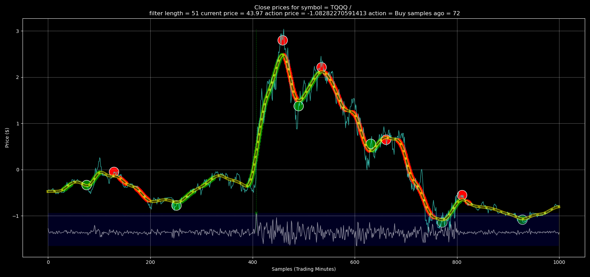

# Simple Alpaca API Trading Bot

This is a simple trading bot using the Alpaca API. The bot uses historical price data and standard deviation thresholds to make buy or sell decisions.

## Requirements

The script requires Python 3.7+ and the following packages:

- alpaca-trade-api
- pandas
- numpy
- scipy
- matplotlib

The bot also relies on the `helper.py` module, which should be located in the same directory as the main script.

## Installation

### Ubuntu 22.04

```
sudo apt-get update
sudo apt-get install -y python3 python3-dev python3-pip libatlas-base-dev gfortran libfreetype6-dev libpng-dev python3-cython
```

### Python Packages

Install the required Python packages using pip:

```bash
pip install -r requirements.txt
```

Compile the **bars.py** script, if desired, by executing the **compile.sh** bash script:

```bash
chmod 711 compile.sh
compile.sh -s bars.py
```

If you do not want to compile the **bars.py** script, then edit the **trading_bot.py** file to execute bars.py, instead of bars (compiled).  You may need to prefix the bars.py with python3 (python3 bars.py instead of bars).

## Usage

```bash
python3 trading_bot.py -s <symbol> -c <cash> -n <ndays> -t <thresh> -w <window>
```

Where:
- `<symbol>`: Stock symbol to trade.
- `<cash>`: Cash for each buy trade. Default is 20000.
- `<ndays>`: Number of days to gather historical prices. Default is 8.
- `<thresh>`: Threshold number of Std-Deviations for Buy. Default is -2.0.
- `<window>`: Filter window in samples. Default is 51.
- `-d`: Enable debug logging. This is optional.

Example:

```bash
python3 trading_bot.py -s TQQQ -c 20000 -n 8 -t -2.0 -w 51
```

### Example bars QC plot for trading_bot parameters:

Here is an example image of the python script to determine buy and sell signals.  Adjust the parameters for current market conditions and your risk preferences.

```
bars.py --symbol TQQQ --num_days 8 --filter_window 51 --std_dev 1
```



## License

This project is licensed under the Apache 2.0 License.
